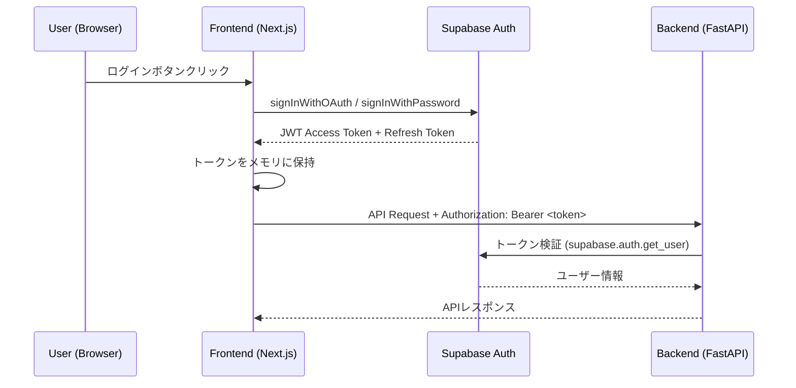

# BeanLog Phase 0 MVP API設計書

## 1. 概要

### 1.1 基本情報

| 項目 | 値 |
|------|-----|
| ベースURL | `https://api.beanlog.app/v1` |
| プロトコル | HTTPS |
| フォーマット | JSON |
| 認証 | Supabase Auth（JWT Bearer Token） |
| API バージョニング | URLパスベース（`/v1/`） |

### 1.2 共通レスポンスフォーマット

**成功時:**
```json
{
  "data": { ... },
  "meta": {
    "page": 1,
    "per_page": 20,
    "total": 150,
    "total_pages": 8
  }
}
```

**エラー時:**
```json
{
  "error": {
    "code": "VALIDATION_ERROR",
    "message": "Rating is required",
    "details": [
      { "field": "rating", "message": "This field is required" }
    ]
  }
}
```

### 1.3 共通HTTPステータスコード

| コード | 意味 |
|--------|------|
| 200 | 成功 |
| 201 | 作成成功 |
| 400 | バリデーションエラー |
| 401 | 未認証 |
| 403 | 権限不足 |
| 404 | リソース未発見 |
| 422 | 処理不可（ビジネスロジックエラー） |
| 429 | レート制限超過 |
| 500 | サーバーエラー |

---

## 2. 認証フロー

### 2.1 概要

Supabase Auth を利用。クライアントは Supabase JS SDK 経由でトークンを取得し、Backend API 呼び出し時に `Authorization: Bearer <token>` ヘッダーで送信。

### 2.2 認証フローシーケンス



### 2.3 トークン管理

| 項目 | 仕様 |
|------|------|
| Access Token 有効期限 | 1時間（Supabase デフォルト） |
| Refresh Token | Supabase SDK が自動リフレッシュ |
| 保存場所 | メモリ（Supabase SDK 管理） |

---

## 3. APIエンドポイント一覧

### 3.1 認証（Supabase Auth 直接利用 — Backend API なし）

認証はフロントエンドから Supabase SDK を直接利用する。Backend には認証エンドポイントを設けない。

### 3.2 ユーザー

| Method | Path | 認証 | 説明 |
|--------|------|------|------|
| GET | `/v1/users/me` | ○ | 自分のプロフィール取得 |
| PATCH | `/v1/users/me` | ○ | プロフィール更新 |
| GET | `/v1/users/:id` | × | ユーザー公開プロフィール取得 |

### 3.3 豆（Beans）

| Method | Path | 認証 | 説明 |
|--------|------|------|------|
| GET | `/v1/beans` | × | 豆一覧取得（検索・フィルタ対応） |
| GET | `/v1/beans/:id` | × | 豆詳細取得 |
| GET | `/v1/beans/barcode/:code` | × | バーコードで豆検索 |

### 3.4 レビュー（Reviews）

| Method | Path | 認証 | 説明 |
|--------|------|------|------|
| GET | `/v1/beans/:beanId/reviews` | × | 豆のレビュー一覧 |
| POST | `/v1/beans/:beanId/reviews` | ○ | レビュー投稿 |
| PATCH | `/v1/reviews/:id` | ○ | レビュー編集（自分のみ） |
| DELETE | `/v1/reviews/:id` | ○ | レビュー削除（自分のみ、論理削除） |
| GET | `/v1/users/:userId/reviews` | × | ユーザーのレビュー一覧 |

### 3.5 ロースター（Roasters）

| Method | Path | 認証 | 説明 |
|--------|------|------|------|
| GET | `/v1/roasters` | × | ロースター一覧 |
| GET | `/v1/roasters/:id` | × | ロースター詳細（取扱豆含む） |

### 3.6 マスターデータ

| Method | Path | 認証 | 説明 |
|--------|------|------|------|
| GET | `/v1/master/origins` | × | 産地一覧 |
| GET | `/v1/master/flavors` | × | フレーバーノート一覧 |
| GET | `/v1/master/processes` | × | 精製方法一覧 |
| GET | `/v1/master/roast-levels` | × | 焙煎度一覧 |
| GET | `/v1/master/brew-methods` | × | 抽出方法一覧 |

---

## 4. エンドポイント詳細

### 4.1 GET `/v1/beans`

豆の一覧取得。検索・フィルタ・ソート・ページネーション対応。

**クエリパラメータ:**
| パラメータ | 型 | 必須 | 説明 |
|-----------|-----|------|------|
| q | string | × | フルテキスト検索 |
| origin | string | × | 産地コード（ISO 3166-1 alpha-2） |
| roast_level | string | × | `light` / `medium_light` / `medium` / `medium_dark` / `dark` |
| process | string | × | `washed` / `natural` / `honey` / `anaerobic` / `other` |
| flavor | string | × | フレーバーノートslug（カンマ区切りで複数） |
| roaster_id | uuid | × | ロースターID |
| sort | string | × | `rating_desc` / `created_desc` / `name_asc`（デフォルト: `created_desc`） |
| page | integer | × | ページ番号（デフォルト: 1） |
| per_page | integer | × | 件数（デフォルト: 20、最大: 50） |
| lang | string | × | `ja` / `en`（デフォルト: `ja`） |

**レスポンス（200）:**
```json
{
  "data": [
    {
      "id": "uuid",
      "name": "エチオピア イルガチェフェ ゲデブ G1",
      "name_en": "Ethiopia Yirgacheffe Gedeb G1",
      "roaster": {
        "id": "uuid",
        "name": "LIGHT UP COFFEE"
      },
      "origin": {
        "code": "ET",
        "name": "エチオピア",
        "name_en": "Ethiopia"
      },
      "roast_level": "light",
      "process": "washed",
      "flavor_notes": ["citrus", "floral", "berry"],
      "avg_rating": 4.2,
      "review_count": 15,
      "image_url": "https://...",
      "created_at": "2026-01-15T10:00:00Z"
    }
  ],
  "meta": {
    "page": 1,
    "per_page": 20,
    "total": 150,
    "total_pages": 8
  }
}
```

### 4.2 GET `/v1/beans/:id`

**レスポンス（200）:**
```json
{
  "data": {
    "id": "uuid",
    "name": "エチオピア イルガチェフェ ゲデブ G1",
    "name_en": "Ethiopia Yirgacheffe Gedeb G1",
    "description": "花のような香りとレモンのような...",
    "description_en": "Floral aroma with lemon-like...",
    "roaster": {
      "id": "uuid",
      "name": "LIGHT UP COFFEE",
      "website_url": "https://lightupcoffee.com"
    },
    "origin": {
      "code": "ET",
      "name": "エチオピア",
      "name_en": "Ethiopia",
      "region": "イルガチェフェ ゲデブ",
      "region_en": "Yirgacheffe Gedeb"
    },
    "variety": "Heirloom",
    "process": "washed",
    "roast_level": "light",
    "altitude_min": 1900,
    "altitude_max": 2200,
    "flavor_notes": ["citrus", "floral", "berry"],
    "barcode": "4900000000001",
    "avg_rating": 4.2,
    "review_count": 15,
    "rating_distribution": {
      "5": 5,
      "4": 6,
      "3": 3,
      "2": 1,
      "1": 0
    },
    "image_url": "https://...",
    "purchase_url": "https://...",
    "created_at": "2026-01-15T10:00:00Z",
    "updated_at": "2026-02-01T10:00:00Z"
  }
}
```

### 4.3 POST `/v1/beans/:beanId/reviews`

**リクエストボディ:**
```json
{
  "rating": 4.5,
  "flavor_notes": ["citrus", "floral"],
  "brew_method": "pour_over",
  "comment": "明るい酸味が特徴的で..."
}
```

| フィールド | 型 | 必須 | バリデーション |
|-----------|-----|------|---------------|
| rating | number | ○ | 1.0-5.0（0.5刻み） |
| flavor_notes | string[] | × | 定義済みslugのみ、最大5個 |
| brew_method | string | × | `pour_over` / `espresso` / `french_press` / `aeropress` / `siphon` / `cold_brew` / `other` |
| comment | string | × | 最大1000文字 |

**レスポンス（201）:**
```json
{
  "data": {
    "id": "uuid",
    "bean_id": "uuid",
    "user": {
      "id": "uuid",
      "username": "coffee_taro",
      "avatar_url": "https://..."
    },
    "rating": 4.5,
    "flavor_notes": ["citrus", "floral"],
    "brew_method": "pour_over",
    "comment": "明るい酸味が特徴的で...",
    "created_at": "2026-02-10T10:00:00Z"
  }
}
```

**エラー（422 — 同じ豆に対して既存レビューあり）:**
```json
{
  "error": {
    "code": "DUPLICATE_REVIEW",
    "message": "You have already reviewed this bean. Please edit your existing review."
  }
}
```

### 4.4 PATCH `/v1/reviews/:id`

**リクエストボディ:**（部分更新）
```json
{
  "rating": 4.0,
  "comment": "修正後のコメント..."
}
```

**レスポンス（200）:** 更新されたレビューオブジェクト（POST と同形式）

### 4.5 DELETE `/v1/reviews/:id`

**レスポンス（200）:**
```json
{
  "data": {
    "id": "uuid",
    "deleted": true
  }
}
```

### 4.6 GET `/v1/users/me`

**レスポンス（200）:**
```json
{
  "data": {
    "id": "uuid",
    "username": "coffee_taro",
    "email": "taro@example.com",
    "avatar_url": "https://...",
    "review_count": 12,
    "preferred_language": "ja",
    "created_at": "2026-01-01T10:00:00Z"
  }
}
```

### 4.7 PATCH `/v1/users/me`

**リクエストボディ:**
```json
{
  "username": "coffee_taro_updated",
  "avatar_url": "https://...",
  "preferred_language": "en"
}
```

### 4.8 GET `/v1/beans/barcode/:code`

**パスパラメータ:**
| パラメータ | 型 | 説明 |
|-----------|-----|------|
| code | string | JANコード（13桁）またはQRコード値 |

**レスポンス（200）:** 豆詳細オブジェクト（`GET /v1/beans/:id` と同形式）

**レスポンス（404）:**
```json
{
  "error": {
    "code": "BEAN_NOT_FOUND",
    "message": "No bean found for barcode: 4900000000001"
  }
}
```

### 4.9 GET `/v1/roasters`

**クエリパラメータ:**
| パラメータ | 型 | 必須 | 説明 |
|-----------|-----|------|------|
| q | string | × | 名前検索 |
| page | integer | × | ページ番号 |
| per_page | integer | × | 件数 |

**レスポンス（200）:**
```json
{
  "data": [
    {
      "id": "uuid",
      "name": "LIGHT UP COFFEE",
      "location": "東京都武蔵野市",
      "bean_count": 12,
      "avg_rating": 4.1,
      "image_url": "https://..."
    }
  ],
  "meta": { "page": 1, "per_page": 20, "total": 10, "total_pages": 1 }
}
```

### 4.10 GET `/v1/roasters/:id`

**レスポンス（200）:**
```json
{
  "data": {
    "id": "uuid",
    "name": "LIGHT UP COFFEE",
    "name_en": "LIGHT UP COFFEE",
    "description": "2014年創業。...",
    "description_en": "Founded in 2014...",
    "location": "東京都武蔵野市吉祥寺本町4-13-15",
    "prefecture": "東京都",
    "website_url": "https://lightupcoffee.com",
    "instagram_url": "https://instagram.com/lightupcoffee",
    "image_url": "https://...",
    "bean_count": 12,
    "avg_rating": 4.1,
    "beans": [
      {
        "id": "uuid",
        "name": "エチオピア イルガチェフェ",
        "avg_rating": 4.2,
        "review_count": 15
      }
    ],
    "created_at": "2026-01-01T10:00:00Z"
  }
}
```

---

## 5. レート制限

| エンドポイント | 制限 |
|---------------|------|
| 認証不要エンドポイント | 60リクエスト/分/IP |
| 認証済みエンドポイント | 120リクエスト/分/ユーザー |
| レビュー投稿 | 10リクエスト/分/ユーザー |

レート制限超過時はHTTP 429を返却。`Retry-After` ヘッダーで再試行可能時刻を通知。

---

## 6. CORS設定

| 許可オリジン |
|-------------|
| `https://beanlog.app` |
| `https://www.beanlog.app` |
| `http://localhost:3000`（開発環境のみ） |
