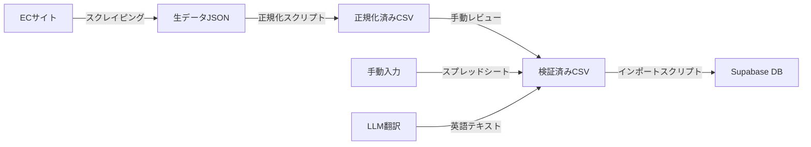

# BeanLog Phase 0 MVP 初期データ収集戦略

## 1. 概要

### 1.1 目標

| 指標 | MVP目標 |
|------|---------|
| 豆データ | 200件以上 |
| ロースター | 5-10店舗 |
| 産地カバー | 主要10カ国以上 |
| データ完成度 | 全必須フィールド入力率 90%以上 |

### 1.2 データ収集方針

**手動入力 + スクレイピングのハイブリッド**

```
手動入力（高品質・少量）
├── ロースター基本情報
├── 豆のコアデータ検証
└── フレーバーノート・説明文の翻訳

スクレイピング（効率化・大量）
├── ECサイトからの豆リスト取得
├── 価格・在庫情報の自動取得
└── 新着豆の定期チェック
```

---

## 2. 対象ロースター候補リスト

### 2.1 選定基準

1. **ECサイトあり** — オンライン販売を行っている（データ取得可能）
2. **スペシャルティ志向** — シングルオリジン、ロット情報を公開
3. **情報の充実度** — 産地・品種・精製方法などの詳細情報を公開
4. **知名度** — コーヒー愛好家間での認知度が高い
5. **多様性** — 地域・規模・スタイルにバリエーション

### 2.2 候補ロースター一覧（10店舗）

| # | ロースター名 | 所在地 | EC | 特徴 | 優先度 |
|---|-------------|--------|-----|------|--------|
| 1 | **LIGHT UP COFFEE** | 東京・吉祥寺 | ○ | 浅煎り特化、産地情報が充実 | ★★★ |
| 2 | **ONIBUS COFFEE** | 東京・中目黒 | ○ | 東京スペシャルティの代表格 | ★★★ |
| 3 | **FUGLEN COFFEE ROASTERS** | 東京・渋谷 | ○ | ノルウェー発、北欧ロースト | ★★★ |
| 4 | **堀口珈琲** | 東京・世田谷 | ○ | 老舗、品種・農園情報が非常に詳しい | ★★★ |
| 5 | **丸山珈琲** | 長野・軽井沢 | ○ | COE審査員、シングルオリジン豊富 | ★★★ |
| 6 | **GLITCH COFFEE** | 東京・神保町 | ○ | 浅煎りスペシャルティ、ロット情報充実 | ★★☆ |
| 7 | **UNLIMITED COFFEE ROASTERS** | 東京・墨田 | ○ | ダイレクトトレード推進 | ★★☆ |
| 8 | **PASSAGE COFFEE** | 東京・蔵前 | ○ | 若手ロースター、SNS発信力高い | ★★☆ |
| 9 | **TRUNK COFFEE** | 名古屋 | ○ | 名古屋スペシャルティの旗手 | ★☆☆ |
| 10 | **ETHICUS** | 京都 | ○ | 関西圏、エシカル志向 | ★☆☆ |

> **Phase 0 は ★★★ の5店舗から着手。** 残り5店舗はデータパイプライン確立後に追加。

---

## 3. スクレイピング対象サイト

### 3.1 対象ページ構造

| ロースター | ECサイトURL | ページ構造 |
|-----------|------------|-----------|
| LIGHT UP COFFEE | `https://lightupcoffee.com` | Shopify ベース |
| ONIBUS COFFEE | `https://onibuscoffee.com` | Shopify ベース |
| FUGLEN COFFEE | `https://fuglencoffee.jp` | Shopify ベース |
| 堀口珈琲 | `https://kohikobo.com` | 独自EC |
| 丸山珈琲 | `https://www.maruyamacoffee.com` | 独自EC |

### 3.2 スクレイピング技術選定

| 方式 | ツール | 用途 |
|------|--------|------|
| 静的HTML | `httpx` + `BeautifulSoup` | Shopify系、シンプルなHTML |
| 動的レンダリング | `Playwright` | SPA系、JavaScript依存ページ |
| Shopify API | Shopify Storefront API | 公開APIがある場合（rate limit注意） |

### 3.3 スクレイピングポリシー

- `robots.txt` を尊重する
- リクエスト間隔は **最低2秒** のディレイ
- User-Agent に `BeanLog Bot` を明示
- 商用利用前にロースターへ **事前連絡** を行う（将来的な提携の布石）
- 取得データはキャッシュし、同一ページへの重複アクセスを防止

---

## 4. データ項目定義

### 4.1 豆データ（beans）

| # | フィールド | 取得方法 | 必須 | 例 |
|---|-----------|---------|------|-----|
| 1 | 豆名 | スクレイピング | ○ | エチオピア イルガチェフェ ゲデブ G1 |
| 2 | 豆名（英語） | 手動翻訳 | △ | Ethiopia Yirgacheffe Gedeb G1 |
| 3 | 説明 | スクレイピング | × | 花のような香りと明るい酸味... |
| 4 | 説明（英語） | 手動翻訳/LLM | × | Floral aroma with bright acidity... |
| 5 | ロースターID | 手動紐付け | ○ | (UUID) |
| 6 | 産地（国） | スクレイピング+正規化 | ○ | エチオピア |
| 7 | 産地（地域） | スクレイピング | △ | イルガチェフェ ゲデブ |
| 8 | 品種 | スクレイピング | △ | Heirloom |
| 9 | 精製方法 | スクレイピング+正規化 | ○ | washed |
| 10 | 焙煎度 | スクレイピング+正規化 | ○ | light |
| 11 | 標高（下限） | スクレイピング | × | 1900 |
| 12 | 標高（上限） | スクレイピング | × | 2200 |
| 13 | フレーバーノート | スクレイピング+マッピング | △ | ["citrus", "floral", "berry"] |
| 14 | バーコード（JAN） | 手動入力 | × | 4900000000001 |
| 15 | 画像URL | スクレイピング | △ | https://... |
| 16 | 購入URL | スクレイピング | △ | https://... |

> ○=必須、△=あれば取得、×=任意

### 4.2 ロースターデータ（roasters）

| # | フィールド | 取得方法 | 必須 | 例 |
|---|-----------|---------|------|-----|
| 1 | ロースター名 | 手動 | ○ | LIGHT UP COFFEE |
| 2 | ロースター名（英語） | 手動 | △ | LIGHT UP COFFEE |
| 3 | 説明 | 手動 | △ | 2014年創業、吉祥寺の... |
| 4 | 説明（英語） | 手動/LLM | × | Founded in 2014... |
| 5 | 所在地 | 手動 | ○ | 東京都武蔵野市吉祥寺本町4-13-15 |
| 6 | 都道府県 | 手動 | ○ | 東京都 |
| 7 | WebサイトURL | 手動 | ○ | https://lightupcoffee.com |
| 8 | Instagram URL | 手動 | △ | https://instagram.com/lightupcoffee |
| 9 | 画像URL | 手動/スクレイピング | △ | https://... |

### 4.3 産地データ（origins）

| # | フィールド | 取得方法 | 例 |
|---|-----------|---------|-----|
| 1 | 国コード | 手動定義 | ET |
| 2 | 国名（日本語） | 手動定義 | エチオピア |
| 3 | 国名（英語） | 手動定義 | Ethiopia |
| 4 | 地域（日本語） | 豆データから抽出 | イルガチェフェ |
| 5 | 地域（英語） | 豆データから抽出 | Yirgacheffe |

### 4.4 対象産地（初期マスター）

| 国コード | 国名 | 主要地域 |
|---------|------|---------|
| ET | エチオピア | イルガチェフェ、シダモ、グジ |
| CO | コロンビア | ウイラ、ナリーニョ、カウカ |
| GT | グアテマラ | アンティグア、ウエウエテナンゴ |
| KE | ケニア | ニエリ、キリニャガ、エンブ |
| BR | ブラジル | セラード、モジアナ、南ミナス |
| CR | コスタリカ | タラス、ウエストバレー |
| PA | パナマ | ボケテ、チリキ |
| RW | ルワンダ | フイエ、ニャマシェケ |
| ID | インドネシア | スマトラ、スラウェシ、ジャワ |
| HN | ホンジュラス | コパン、サンタバルバラ |

---

## 5. データ正規化ルール

### 5.1 焙煎度の正規化

| 入力パターン | 正規化後 |
|-------------|---------|
| 浅煎り, ライトロースト, Light | `light` |
| 中浅煎り, ミディアムライト, Medium Light | `medium_light` |
| 中煎り, ミディアムロースト, Medium | `medium` |
| 中深煎り, ミディアムダーク, Medium Dark | `medium_dark` |
| 深煎り, ダークロースト, Dark, フレンチ | `dark` |

### 5.2 精製方法の正規化

| 入力パターン | 正規化後 |
|-------------|---------|
| ウォッシュド, 水洗式, Washed, Fully Washed | `washed` |
| ナチュラル, 乾燥式, Natural, Dry Process | `natural` |
| ハニー, パルプドナチュラル, Honey, Pulped Natural | `honey` |
| アナエロビック, 嫌気性発酵, Anaerobic | `anaerobic` |
| カーボニックマセレーション, CM | `carbonic_maceration` |
| その他 | `other` |

### 5.3 フレーバーノートのマッピング

スクレイピングで取得したフレーバーテキストを `flavor_notes.slug` にマッピング。

```python
FLAVOR_MAPPING = {
    # 日本語 → slug
    "ベリー": "berry", "ブルーベリー": "berry", "ストロベリー": "berry",
    "シトラス": "citrus", "レモン": "citrus", "オレンジ": "citrus", "グレープフルーツ": "citrus",
    "ピーチ": "stone_fruit", "プラム": "stone_fruit", "アプリコット": "stone_fruit",
    "マンゴー": "tropical", "パッションフルーツ": "tropical", "パイナップル": "tropical",
    "レーズン": "dried_fruit", "デーツ": "dried_fruit",
    "ジャスミン": "jasmine", "ローズ": "rose",
    "チョコレート": "chocolate", "カカオ": "chocolate", "ダークチョコ": "chocolate",
    "キャラメル": "caramel", "カラメル": "caramel",
    "はちみつ": "honey", "ハニー": "honey",
    "バニラ": "vanilla",
    "ナッツ": "almond", "アーモンド": "almond",
    "ヘーゼルナッツ": "hazelnut",
    "シナモン": "cinnamon",
    "スモーキー": "smoky",
    "ハーブ": "herbal", "ハーバル": "herbal",
    # 英語 → slug
    "berry": "berry", "blueberry": "berry", "strawberry": "berry",
    "citrus": "citrus", "lemon": "citrus", "orange": "citrus",
    "chocolate": "chocolate", "cocoa": "chocolate",
    "caramel": "caramel", "honey": "honey",
    "floral": "jasmine", "jasmine": "jasmine",
    "nutty": "almond", "almond": "almond",
}
```

---

## 6. データ収集パイプライン

### 6.1 全体フロー



### 6.2 スクリプト構成

```
scripts/
├── scraper/
│   ├── base.py          # スクレイパー基底クラス
│   ├── shopify.py       # Shopify系共通スクレイパー
│   ├── lightup.py       # LIGHT UP COFFEE 固有処理
│   ├── horiguchi.py     # 堀口珈琲 固有処理
│   └── maruyama.py      # 丸山珈琲 固有処理
├── normalizer/
│   ├── roast_level.py   # 焙煎度の正規化
│   ├── process.py       # 精製方法の正規化
│   └── flavor.py        # フレーバーノートのマッピング
├── importer/
│   ├── seed_masters.py  # マスターデータ投入
│   ├── import_beans.py  # 豆データ投入
│   └── import_roasters.py # ロースターデータ投入
└── translator/
    └── translate.py     # LLM利用の日英翻訳
```

### 6.3 スケジュール

| 週 | タスク | 担当 |
|----|--------|------|
| Week 1 | ロースター基本情報の手動入力（5店舗） | 手動 |
| Week 1 | マスターデータ（産地、フレーバー）投入 | スクリプト |
| Week 2 | Shopify系スクレイパー開発・実行 | 開発 |
| Week 2 | LIGHT UP / ONIBUS / FUGLEN の豆データ取得 | スクレイパー |
| Week 3 | 独自EC系スクレイパー開発・実行 | 開発 |
| Week 3 | 堀口 / 丸山 の豆データ取得 | スクレイパー |
| Week 4 | データ検証・正規化・英語翻訳 | 手動+LLM |
| Week 4 | 本番DB投入・動作確認 | スクリプト |

---

## 7. データ品質管理

### 7.1 品質チェック項目

| チェック | 基準 | 自動化 |
|---------|------|--------|
| 必須フィールド充足率 | 90%以上 | ○ |
| 産地コードの妥当性 | ISO 3166-1 準拠 | ○ |
| 焙煎度の正規化成功率 | 95%以上 | ○ |
| 画像URL有効性 | HTTP 200返却 | ○ |
| 重複チェック | 同一ロースター×豆名で重複なし | ○ |
| フレーバーマッピング率 | 80%以上（未マッピングは手動） | △ |

### 7.2 データ更新方針

| 項目 | 頻度 | 方法 |
|------|------|------|
| 新着豆の追加 | 週1回 | スクレイパー定期実行 |
| 販売終了豆のフラグ | 月1回 | 手動確認 |
| ロースター情報更新 | 月1回 | 手動確認 |
| 価格変動 | Phase 1 で検討 | — |

---

## 8. 法的考慮事項

### 8.1 データ収集に関する注意

- ECサイトの **利用規約** を事前確認（スクレイピング禁止の有無）
- 商品画像の利用は **引用の範囲** に留める（サムネイル程度）
- 将来的にはロースターとの **提携契約** で正式にデータ提供を受ける
- 個人情報は収集しない（レビューアーのデータはBeanLog内で完結）

### 8.2 ロースターへのアプローチ

Phase 0 では非公式にデータを収集するが、早い段階でロースターに接触し：

1. BeanLogのコンセプト説明
2. データ掲載の許諾取得
3. 将来的な提携（公式データ提供、購入リンク送客）提案

を行う。MVP の KPI として **提携ロースター5店舗** を目標とする。
