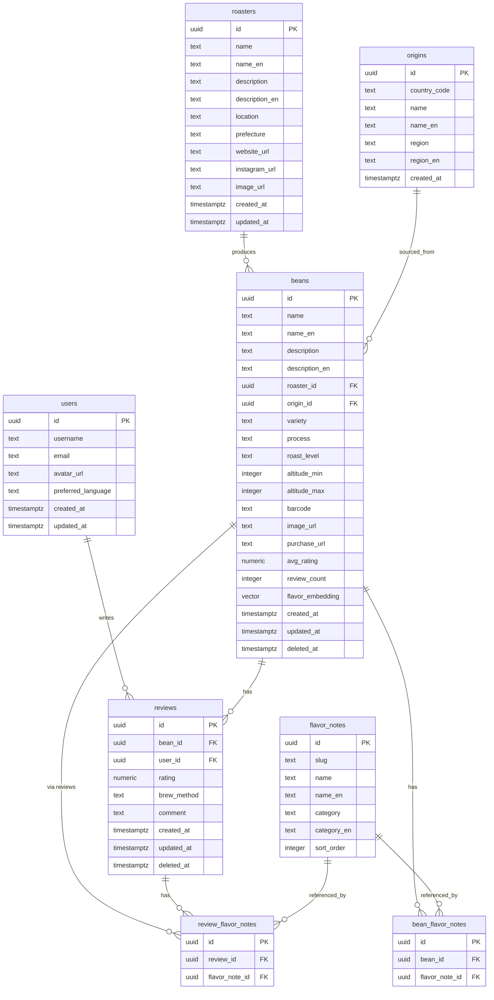

# BeanLog Phase 0 MVP DBスキーマ設計

## 1. 概要

| 項目 | 値 |
|------|-----|
| DBMS | PostgreSQL 15+（Supabase） |
| 拡張 | pgvector, pg_trgm（トライグラム検索） |
| UUID生成 | `gen_random_uuid()`（PostgreSQL組み込み） |
| タイムスタンプ | UTC（`timestamptz`） |
| 論理削除 | `deleted_at` カラム方式 |
| 多言語 | `_en` サフィックスカラム方式 |

---

## 2. ER図



---

## 3. テーブル定義

### 3.1 `users`

Supabase Auth の `auth.users` と連携。`public.users` はプロフィール情報を管理。

```sql
CREATE TABLE public.users (
    id          UUID PRIMARY KEY REFERENCES auth.users(id) ON DELETE CASCADE,
    username    TEXT NOT NULL UNIQUE,
    email       TEXT NOT NULL,
    avatar_url  TEXT,
    preferred_language TEXT NOT NULL DEFAULT 'ja'
        CHECK (preferred_language IN ('ja', 'en')),
    created_at  TIMESTAMPTZ NOT NULL DEFAULT NOW(),
    updated_at  TIMESTAMPTZ NOT NULL DEFAULT NOW()
);

-- Supabase Auth の新規ユーザー作成時に自動でプロフィール作成
CREATE OR REPLACE FUNCTION public.handle_new_user()
RETURNS TRIGGER AS $$
BEGIN
    INSERT INTO public.users (id, username, email, avatar_url)
    VALUES (
        NEW.id,
        COALESCE(NEW.raw_user_meta_data->>'username', 'user_' || LEFT(NEW.id::TEXT, 8)),
        NEW.email,
        NEW.raw_user_meta_data->>'avatar_url'
    );
    RETURN NEW;
END;
$$ LANGUAGE plpgsql SECURITY DEFINER;

CREATE TRIGGER on_auth_user_created
    AFTER INSERT ON auth.users
    FOR EACH ROW EXECUTE FUNCTION public.handle_new_user();
```

### 3.2 `roasters`

```sql
CREATE TABLE public.roasters (
    id              UUID PRIMARY KEY DEFAULT gen_random_uuid(),
    name            TEXT NOT NULL,
    name_en         TEXT,
    description     TEXT,
    description_en  TEXT,
    location        TEXT,
    prefecture      TEXT,
    website_url     TEXT,
    instagram_url   TEXT,
    image_url       TEXT,
    created_at      TIMESTAMPTZ NOT NULL DEFAULT NOW(),
    updated_at      TIMESTAMPTZ NOT NULL DEFAULT NOW()
);

CREATE INDEX idx_roasters_name ON public.roasters USING gin (name gin_trgm_ops);
CREATE INDEX idx_roasters_prefecture ON public.roasters (prefecture);
```

### 3.3 `origins`

```sql
CREATE TABLE public.origins (
    id              UUID PRIMARY KEY DEFAULT gen_random_uuid(),
    country_code    TEXT NOT NULL,  -- ISO 3166-1 alpha-2
    name            TEXT NOT NULL,  -- 日本語国名
    name_en         TEXT NOT NULL,  -- 英語国名
    region          TEXT,           -- 地域名（日本語）
    region_en       TEXT,           -- 地域名（英語）
    created_at      TIMESTAMPTZ NOT NULL DEFAULT NOW(),
    UNIQUE (country_code, region)
);

CREATE INDEX idx_origins_country ON public.origins (country_code);
```

### 3.4 `beans`

```sql
CREATE EXTENSION IF NOT EXISTS vector;

CREATE TABLE public.beans (
    id              UUID PRIMARY KEY DEFAULT gen_random_uuid(),
    name            TEXT NOT NULL,
    name_en         TEXT,
    description     TEXT,
    description_en  TEXT,
    roaster_id      UUID NOT NULL REFERENCES public.roasters(id),
    origin_id       UUID REFERENCES public.origins(id),
    variety         TEXT,           -- 品種 (Gesha, Bourbon, SL28等)
    process         TEXT CHECK (process IN (
                        'washed', 'natural', 'honey',
                        'anaerobic', 'carbonic_maceration', 'other'
                    )),
    roast_level     TEXT CHECK (roast_level IN (
                        'light', 'medium_light', 'medium',
                        'medium_dark', 'dark'
                    )),
    altitude_min    INTEGER,        -- 栽培高度(m) 下限
    altitude_max    INTEGER,        -- 栽培高度(m) 上限
    barcode         TEXT UNIQUE,    -- JANコード
    image_url       TEXT,
    purchase_url    TEXT,
    avg_rating      NUMERIC(2,1) DEFAULT 0.0,
    review_count    INTEGER DEFAULT 0,
    flavor_embedding VECTOR(384),   -- フレーバーの埋め込みベクトル（Phase 1で本格活用）
    created_at      TIMESTAMPTZ NOT NULL DEFAULT NOW(),
    updated_at      TIMESTAMPTZ NOT NULL DEFAULT NOW(),
    deleted_at      TIMESTAMPTZ
);

-- 検索用インデックス
CREATE INDEX idx_beans_roaster ON public.beans (roaster_id);
CREATE INDEX idx_beans_origin ON public.beans (origin_id);
CREATE INDEX idx_beans_process ON public.beans (process);
CREATE INDEX idx_beans_roast_level ON public.beans (roast_level);
CREATE INDEX idx_beans_barcode ON public.beans (barcode) WHERE barcode IS NOT NULL;
CREATE INDEX idx_beans_name_trgm ON public.beans USING gin (name gin_trgm_ops);
CREATE INDEX idx_beans_avg_rating ON public.beans (avg_rating DESC);
CREATE INDEX idx_beans_created ON public.beans (created_at DESC);
CREATE INDEX idx_beans_deleted ON public.beans (deleted_at) WHERE deleted_at IS NULL;

-- フレーバーベクトル類似検索用（Phase 1）
CREATE INDEX idx_beans_flavor_embedding ON public.beans
    USING ivfflat (flavor_embedding vector_cosine_ops)
    WITH (lists = 10);
```

### 3.5 `flavor_notes`

SCA Flavor Wheel 準拠のマスターデータ。

```sql
CREATE TABLE public.flavor_notes (
    id          UUID PRIMARY KEY DEFAULT gen_random_uuid(),
    slug        TEXT NOT NULL UNIQUE,   -- 'citrus', 'berry' 等
    name        TEXT NOT NULL,          -- 日本語名
    name_en     TEXT NOT NULL,          -- 英語名
    category    TEXT NOT NULL,          -- カテゴリ日本語 ('フルーティ'等)
    category_en TEXT NOT NULL,          -- カテゴリ英語 ('Fruity'等)
    sort_order  INTEGER NOT NULL DEFAULT 0
);

CREATE INDEX idx_flavor_notes_category ON public.flavor_notes (category);
CREATE INDEX idx_flavor_notes_slug ON public.flavor_notes (slug);
```

### 3.6 `bean_flavor_notes`

豆のデフォルトフレーバーノート（ロースター公式情報）。

```sql
CREATE TABLE public.bean_flavor_notes (
    id              UUID PRIMARY KEY DEFAULT gen_random_uuid(),
    bean_id         UUID NOT NULL REFERENCES public.beans(id) ON DELETE CASCADE,
    flavor_note_id  UUID NOT NULL REFERENCES public.flavor_notes(id),
    UNIQUE (bean_id, flavor_note_id)
);

CREATE INDEX idx_bean_flavor_bean ON public.bean_flavor_notes (bean_id);
CREATE INDEX idx_bean_flavor_note ON public.bean_flavor_notes (flavor_note_id);
```

### 3.7 `reviews`

```sql
CREATE TABLE public.reviews (
    id          UUID PRIMARY KEY DEFAULT gen_random_uuid(),
    bean_id     UUID NOT NULL REFERENCES public.beans(id),
    user_id     UUID NOT NULL REFERENCES public.users(id),
    rating      NUMERIC(2,1) NOT NULL CHECK (rating >= 1.0 AND rating <= 5.0),
    brew_method TEXT CHECK (brew_method IN (
                    'pour_over', 'espresso', 'french_press',
                    'aeropress', 'siphon', 'cold_brew', 'other'
                )),
    comment     TEXT CHECK (char_length(comment) <= 1000),
    created_at  TIMESTAMPTZ NOT NULL DEFAULT NOW(),
    updated_at  TIMESTAMPTZ NOT NULL DEFAULT NOW(),
    deleted_at  TIMESTAMPTZ,
    UNIQUE (bean_id, user_id)  -- 1ユーザー1豆につき1レビュー
);

CREATE INDEX idx_reviews_bean ON public.reviews (bean_id) WHERE deleted_at IS NULL;
CREATE INDEX idx_reviews_user ON public.reviews (user_id) WHERE deleted_at IS NULL;
CREATE INDEX idx_reviews_created ON public.reviews (created_at DESC);
```

### 3.8 `review_flavor_notes`

レビュー時にユーザーが選択したフレーバーノート。

```sql
CREATE TABLE public.review_flavor_notes (
    id              UUID PRIMARY KEY DEFAULT gen_random_uuid(),
    review_id       UUID NOT NULL REFERENCES public.reviews(id) ON DELETE CASCADE,
    flavor_note_id  UUID NOT NULL REFERENCES public.flavor_notes(id),
    UNIQUE (review_id, flavor_note_id)
);

CREATE INDEX idx_review_flavor_review ON public.review_flavor_notes (review_id);
CREATE INDEX idx_review_flavor_note ON public.review_flavor_notes (flavor_note_id);
```

---

## 4. トリガー / ファンクション

### 4.1 レビュー集計の自動更新

```sql
CREATE OR REPLACE FUNCTION public.update_bean_rating()
RETURNS TRIGGER AS $$
BEGIN
    UPDATE public.beans SET
        avg_rating = (
            SELECT ROUND(AVG(rating), 1)
            FROM public.reviews
            WHERE bean_id = COALESCE(NEW.bean_id, OLD.bean_id)
              AND deleted_at IS NULL
        ),
        review_count = (
            SELECT COUNT(*)
            FROM public.reviews
            WHERE bean_id = COALESCE(NEW.bean_id, OLD.bean_id)
              AND deleted_at IS NULL
        ),
        updated_at = NOW()
    WHERE id = COALESCE(NEW.bean_id, OLD.bean_id);
    RETURN COALESCE(NEW, OLD);
END;
$$ LANGUAGE plpgsql;

CREATE TRIGGER trigger_update_bean_rating
    AFTER INSERT OR UPDATE OR DELETE ON public.reviews
    FOR EACH ROW EXECUTE FUNCTION public.update_bean_rating();
```

### 4.2 updated_at 自動更新

```sql
CREATE OR REPLACE FUNCTION public.set_updated_at()
RETURNS TRIGGER AS $$
BEGIN
    NEW.updated_at = NOW();
    RETURN NEW;
END;
$$ LANGUAGE plpgsql;

CREATE TRIGGER set_updated_at_users
    BEFORE UPDATE ON public.users
    FOR EACH ROW EXECUTE FUNCTION public.set_updated_at();

CREATE TRIGGER set_updated_at_beans
    BEFORE UPDATE ON public.beans
    FOR EACH ROW EXECUTE FUNCTION public.set_updated_at();

CREATE TRIGGER set_updated_at_roasters
    BEFORE UPDATE ON public.roasters
    FOR EACH ROW EXECUTE FUNCTION public.set_updated_at();

CREATE TRIGGER set_updated_at_reviews
    BEFORE UPDATE ON public.reviews
    FOR EACH ROW EXECUTE FUNCTION public.set_updated_at();
```

---

## 5. Row Level Security (RLS)

Supabase の RLS を活用し、データアクセスを制御。

```sql
-- users: 自分のプロフィールのみ更新可能
ALTER TABLE public.users ENABLE ROW LEVEL SECURITY;

CREATE POLICY "Users can view all profiles"
    ON public.users FOR SELECT USING (true);

CREATE POLICY "Users can update own profile"
    ON public.users FOR UPDATE USING (auth.uid() = id);

-- reviews: 誰でも閲覧可能、投稿・編集・削除は自分のみ
ALTER TABLE public.reviews ENABLE ROW LEVEL SECURITY;

CREATE POLICY "Reviews are viewable by everyone"
    ON public.reviews FOR SELECT USING (deleted_at IS NULL);

CREATE POLICY "Authenticated users can create reviews"
    ON public.reviews FOR INSERT WITH CHECK (auth.uid() = user_id);

CREATE POLICY "Users can update own reviews"
    ON public.reviews FOR UPDATE USING (auth.uid() = user_id);

CREATE POLICY "Users can delete own reviews"
    ON public.reviews FOR DELETE USING (auth.uid() = user_id);

-- beans, roasters, origins, flavor_notes: 全ユーザー閲覧可能（管理者のみ編集）
ALTER TABLE public.beans ENABLE ROW LEVEL SECURITY;
ALTER TABLE public.roasters ENABLE ROW LEVEL SECURITY;
ALTER TABLE public.origins ENABLE ROW LEVEL SECURITY;
ALTER TABLE public.flavor_notes ENABLE ROW LEVEL SECURITY;

CREATE POLICY "Beans viewable by all" ON public.beans FOR SELECT USING (deleted_at IS NULL);
CREATE POLICY "Roasters viewable by all" ON public.roasters FOR SELECT USING (true);
CREATE POLICY "Origins viewable by all" ON public.origins FOR SELECT USING (true);
CREATE POLICY "Flavor notes viewable by all" ON public.flavor_notes FOR SELECT USING (true);
```

---

## 6. pgvector カラム設計

### 6.1 目的

`beans.flavor_embedding` カラムは、豆のフレーバープロファイルをベクトル化して格納する。Phase 1 で「類似豆レコメンド」を実現するための準備。

### 6.2 ベクトル生成方針

| 項目 | 値 |
|------|-----|
| ベクトル次元 | 384次元 |
| 埋め込みモデル | `all-MiniLM-L6-v2`（sentence-transformers） |
| 入力テキスト | フレーバーノート + 産地 + 精製方法 を結合したテキスト |
| 距離関数 | コサイン類似度（`vector_cosine_ops`） |
| インデックス | IVFFlat（lists=10、データ量に応じて調整） |

### 6.3 ベクトル生成例

```python
from sentence_transformers import SentenceTransformer

model = SentenceTransformer('all-MiniLM-L6-v2')

# 豆の特徴をテキスト化
text = "Ethiopia Yirgacheffe, Washed, Light Roast, Citrus, Floral, Berry"
embedding = model.encode(text)  # -> 384次元ベクトル
```

### 6.4 類似豆検索クエリ（Phase 1）

```sql
SELECT id, name, 1 - (flavor_embedding <=> $1) AS similarity
FROM beans
WHERE deleted_at IS NULL
  AND id != $2
ORDER BY flavor_embedding <=> $1
LIMIT 5;
```

### 6.5 MVPでの扱い

Phase 0 では `flavor_embedding` カラムは **NULL** のまま。データ投入スクリプトでバッチ的にベクトルを生成・格納する準備だけ行う。

---

## 7. 初期データ（シードデータ）

### 7.1 フレーバーノート マスターデータ

```sql
INSERT INTO public.flavor_notes (slug, name, name_en, category, category_en, sort_order) VALUES
-- Fruity
('berry', 'ベリー', 'Berry', 'フルーティ', 'Fruity', 101),
('citrus', 'シトラス', 'Citrus', 'フルーティ', 'Fruity', 102),
('stone_fruit', 'ストーンフルーツ', 'Stone Fruit', 'フルーティ', 'Fruity', 103),
('tropical', 'トロピカル', 'Tropical', 'フルーティ', 'Fruity', 104),
('dried_fruit', 'ドライフルーツ', 'Dried Fruit', 'フルーティ', 'Fruity', 105),
-- Floral
('jasmine', 'ジャスミン', 'Jasmine', 'フローラル', 'Floral', 201),
('rose', 'ローズ', 'Rose', 'フローラル', 'Floral', 202),
('lavender', 'ラベンダー', 'Lavender', 'フローラル', 'Floral', 203),
-- Sweet
('chocolate', 'チョコレート', 'Chocolate', 'スイート', 'Sweet', 301),
('caramel', 'キャラメル', 'Caramel', 'スイート', 'Sweet', 302),
('honey', 'ハチミツ', 'Honey', 'スイート', 'Sweet', 303),
('vanilla', 'バニラ', 'Vanilla', 'スイート', 'Sweet', 304),
('brown_sugar', '黒糖', 'Brown Sugar', 'スイート', 'Sweet', 305),
-- Nutty
('almond', 'アーモンド', 'Almond', 'ナッティ', 'Nutty', 401),
('hazelnut', 'ヘーゼルナッツ', 'Hazelnut', 'ナッティ', 'Nutty', 402),
('peanut', 'ピーナッツ', 'Peanut', 'ナッティ', 'Nutty', 403),
('walnut', 'くるみ', 'Walnut', 'ナッティ', 'Nutty', 404),
-- Spicy
('cinnamon', 'シナモン', 'Cinnamon', 'スパイシー', 'Spicy', 501),
('clove', 'クローブ', 'Clove', 'スパイシー', 'Spicy', 502),
('black_pepper', 'ブラックペッパー', 'Black Pepper', 'スパイシー', 'Spicy', 503),
-- Roasted
('smoky', 'スモーキー', 'Smoky', 'ロースト', 'Roasted', 601),
('tobacco', 'タバコ', 'Tobacco', 'ロースト', 'Roasted', 602),
('cereal', 'シリアル', 'Cereal', 'ロースト', 'Roasted', 603),
-- Savory
('herbal', 'ハーバル', 'Herbal', 'セイボリー', 'Savory', 701),
('earthy', 'アーシー', 'Earthy', 'セイボリー', 'Savory', 702),
('woody', 'ウッディ', 'Woody', 'セイボリー', 'Savory', 703),
-- Sour/Fermented
('winey', 'ワイニー', 'Winey', '発酵', 'Sour/Fermented', 801),
('whiskey', 'ウイスキー', 'Whiskey', '発酵', 'Sour/Fermented', 802),
('fermented', 'ファーメンテッド', 'Fermented', '発酵', 'Sour/Fermented', 803);
```
