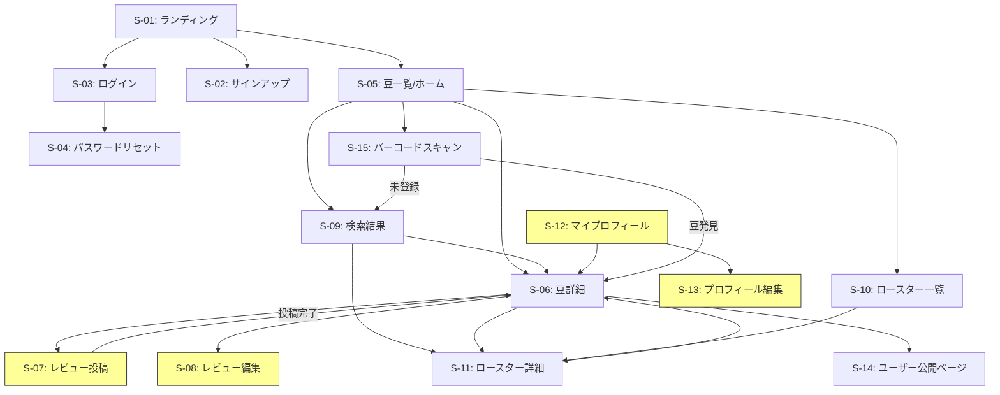

# BeanLog Phase 0 MVP 機能仕様書

## 1. 概要

### 1.1 プロダクトビジョン
BeanLog は「コーヒー豆のVivino」として、スペシャルティコーヒー愛好家が豆を記録・レビュー・発見できるWebプラットフォーム（PWA）。

### 1.2 MVP スコープ
Phase 0 では以下に集中する：

| 含む | 含まない（Phase 1以降） |
|------|----------------------|
| Webアプリ（PWA） | ネイティブアプリ |
| 手動検索 + バーコード検索 | AI画像認識によるパッケージスキャン |
| テイスティングレビュー投稿・閲覧 | フレーバーベクトルによるレコメンド |
| 豆DB（初期200件） | ロースター公式ダッシュボード |
| Supabase Auth（メール/Google/Apple） | アフィリエイト・課金 |
| 日英対応（i18n） | SNSシェア最適化 |
| 基本検索・フィルタ | 高度なレコメンドエンジン |

### 1.3 技術スタック（確定）

| レイヤー | 技術 |
|---------|------|
| Frontend | Next.js + TypeScript（PWA） |
| Backend | FastAPI（Python） |
| DB | Supabase（PostgreSQL + pgvector） |
| Auth | Supabase Auth |
| Hosting | Vercel（FE）+ Railway/Fly.io（BE） |
| Storage | Supabase Storage（画像） |

---

## 2. ユーザーストーリー

### 2.1 ユーザーペルソナ

| ペルソナ | 説明 |
|---------|------|
| **コーヒー太郎**（28歳・会社員） | 週末にスペシャルティコーヒーを飲む。豆の感想を記録したいが、Instagramストーリーズでは流れてしまう |
| **Emily**（32歳・米国在住） | 日本旅行で飲んだコーヒーに感動。帰国後も日本のロースターの豆を探したい |
| **ロースター店主 佐藤さん**（45歳） | 自店の豆がどう評価されているか知りたい。新規顧客獲得にもつなげたい |

### 2.2 Epic 一覧

| Epic ID | Epic名 | 優先度 |
|---------|--------|--------|
| E-01 | ユーザー認証 | P0 |
| E-02 | 豆データベース閲覧 | P0 |
| E-03 | 豆検索・フィルタ | P0 |
| E-04 | テイスティングレビュー | P0 |
| E-05 | ロースター情報 | P0 |
| E-06 | ユーザープロフィール | P1 |
| E-07 | 多言語対応（日/英） | P1 |
| E-08 | バーコードスキャン | P1 |

### 2.3 ユーザーストーリー詳細

#### E-01: ユーザー認証

| ID | ストーリー | 受入条件 |
|----|-----------|---------|
| US-01-01 | ユーザーとして、メールアドレスで新規登録できる | メール+パスワードで登録完了。確認メール送信。 |
| US-01-02 | ユーザーとして、Googleアカウントでサインアップ/ログインできる | Googleアカウント連携でワンクリックログイン |
| US-01-03 | ユーザーとして、Appleアカウントでサインアップ/ログインできる | Apple ID連携でログイン |
| US-01-04 | ユーザーとして、ログアウトできる | セッション破棄、ログイン画面に遷移 |
| US-01-05 | ユーザーとして、パスワードリセットできる | メールでリセットリンク送信 |
| US-01-06 | 未ログインユーザーとして、豆情報の閲覧・検索はできる | 閲覧は認証不要。レビュー投稿時にログイン要求 |

#### E-02: 豆データベース閲覧

| ID | ストーリー | 受入条件 |
|----|-----------|---------|
| US-02-01 | ユーザーとして、豆の一覧を閲覧できる | ページネーション付きカード形式で表示（20件/ページ） |
| US-02-02 | ユーザーとして、豆の詳細ページを閲覧できる | 産地、品種、精製方法、焙煎度、ロースター、フレーバーノート、平均評価、レビュー一覧 |
| US-02-03 | ユーザーとして、豆の平均評価を確認できる | 5段階評価の平均値と件数を表示 |
| US-02-04 | ユーザーとして、豆のフレーバープロファイルを視覚的に確認できる | レーダーチャートまたはタグクラウドで表示 |

#### E-03: 豆検索・フィルタ

| ID | ストーリー | 受入条件 |
|----|-----------|---------|
| US-03-01 | ユーザーとして、キーワードで豆を検索できる | 豆名、ロースター名、産地名でのフルテキスト検索 |
| US-03-02 | ユーザーとして、産地でフィルタできる | 国名（エチオピア、コロンビア等）でフィルタ |
| US-03-03 | ユーザーとして、焙煎度でフィルタできる | Light / Medium Light / Medium / Medium Dark / Dark |
| US-03-04 | ユーザーとして、精製方法でフィルタできる | Washed / Natural / Honey / Anaerobic 等 |
| US-03-05 | ユーザーとして、フレーバーノートでフィルタできる | フルーティ、ナッツ、チョコレート等のタグ選択 |
| US-03-06 | ユーザーとして、評価順/新着順でソートできる | 平均評価降順、登録日降順 |
| US-03-07 | ユーザーとして、ロースターでフィルタできる | ロースター名で絞り込み |

#### E-04: テイスティングレビュー

| ID | ストーリー | 受入条件 |
|----|-----------|---------|
| US-04-01 | ログインユーザーとして、豆にレビューを投稿できる | 5段階評価（必須）+ フレーバーノート選択（任意）+ フリーテキスト（任意）+ 抽出方法（任意） |
| US-04-02 | ログインユーザーとして、自分のレビューを編集できる | 投稿後の修正可能 |
| US-04-03 | ログインユーザーとして、自分のレビューを削除できる | 論理削除 |
| US-04-04 | ユーザーとして、豆のレビュー一覧を閲覧できる | 新着順で表示。投稿者名、評価、フレーバーノート、コメント |
| US-04-05 | ログインユーザーとして、レビュー時にフレーバーホイールから風味を選択できる | SCA準拠のフレーバーホイール（カテゴリ→サブカテゴリの2階層） |
| US-04-06 | ログインユーザーとして、レビュー時に抽出方法を記録できる | ドリップ / エスプレッソ / フレンチプレス / AeroPress / サイフォン / コールドブリュー / その他 |

#### E-05: ロースター情報

| ID | ストーリー | 受入条件 |
|----|-----------|---------|
| US-05-01 | ユーザーとして、ロースター一覧を閲覧できる | ロースター名、所在地、取扱豆数 |
| US-05-02 | ユーザーとして、ロースター詳細を閲覧できる | ロースター名、説明、所在地、WebサイトURL、取扱豆一覧 |
| US-05-03 | ユーザーとして、ロースターのWebサイトへ遷移できる | 外部リンクで公式サイトに飛ぶ |

#### E-06: ユーザープロフィール

| ID | ストーリー | 受入条件 |
|----|-----------|---------|
| US-06-01 | ログインユーザーとして、自分のプロフィールを閲覧できる | ユーザー名、アバター、レビュー数、投稿レビュー一覧 |
| US-06-02 | ログインユーザーとして、ユーザー名とアバターを編集できる | 変更が即時反映 |
| US-06-03 | ユーザーとして、他のユーザーのプロフィールを閲覧できる | 公開レビュー一覧のみ表示 |

#### E-07: 多言語対応

| ID | ストーリー | 受入条件 |
|----|-----------|---------|
| US-07-01 | ユーザーとして、UIの表示言語を日本語/英語で切り替えられる | ヘッダーの言語スイッチで切替。ブラウザ言語で初期値決定 |
| US-07-02 | 豆データが日英バイリンガルで表示される | 豆名、産地名、フレーバーノートは日英併記 |

#### E-08: バーコードスキャン

| ID | ストーリー | 受入条件 |
|----|-----------|---------|
| US-08-01 | ユーザーとして、バーコードをスキャンして豆を検索できる | カメラでJANコード/QRコードを読取 → 豆詳細へ遷移。未登録の場合は「見つかりませんでした」表示 |

---

## 3. 画面一覧

| 画面ID | 画面名 | パス | 認証 |
|--------|--------|------|------|
| S-01 | ランディングページ | `/` | 不要 |
| S-02 | サインアップ | `/signup` | 不要 |
| S-03 | ログイン | `/login` | 不要 |
| S-04 | パスワードリセット | `/reset-password` | 不要 |
| S-05 | 豆一覧（ホーム） | `/beans` | 不要 |
| S-06 | 豆詳細 | `/beans/:id` | 不要 |
| S-07 | レビュー投稿 | `/beans/:id/review` | **必要** |
| S-08 | レビュー編集 | `/beans/:id/review/:reviewId/edit` | **必要** |
| S-09 | 検索結果 | `/search?q=...` | 不要 |
| S-10 | ロースター一覧 | `/roasters` | 不要 |
| S-11 | ロースター詳細 | `/roasters/:id` | 不要 |
| S-12 | マイプロフィール | `/profile` | **必要** |
| S-13 | プロフィール編集 | `/profile/edit` | **必要** |
| S-14 | ユーザー公開ページ | `/users/:id` | 不要 |
| S-15 | バーコードスキャン | `/scan` | 不要 |

### 3.1 画面遷移図

> 黄色 = 要認証画面

---

## 4. 画面別 入出力定義

### S-02: サインアップ

**入力:**
| フィールド | 型 | 必須 | バリデーション |
|-----------|-----|------|---------------|
| メールアドレス | string | ○ | メール形式 |
| パスワード | string | ○ | 8文字以上、英数記号混合 |
| ユーザー名 | string | ○ | 2-30文字、英数字・日本語・アンダースコア |

**出力:** 確認メール送信 → ログイン画面へリダイレクト

### S-07: レビュー投稿

**入力:**
| フィールド | 型 | 必須 | バリデーション |
|-----------|-----|------|---------------|
| 総合評価 | integer | ○ | 1-5（0.5刻み） |
| フレーバーノート | string[] | × | 定義済みリストから複数選択（最大5つ） |
| 抽出方法 | enum | × | 定義済みリストから1つ選択 |
| コメント | string | × | 最大1000文字 |

**出力:** 豆詳細ページにレビューが追加表示

### S-09: 検索結果

**入力:**
| フィールド | 型 | 必須 | 説明 |
|-----------|-----|------|------|
| q | string | × | フリーテキスト検索 |
| origin | string | × | 産地フィルタ |
| roast_level | enum | × | 焙煎度フィルタ |
| process | enum | × | 精製方法フィルタ |
| flavor | string[] | × | フレーバーフィルタ |
| roaster | string | × | ロースターフィルタ |
| sort | enum | × | rating_desc / created_desc |
| page | integer | × | ページ番号（デフォルト1） |

**出力:** 豆カード一覧（豆名、ロースター名、産地、焙煎度、平均評価、レビュー数）

---

## 5. フレーバーホイール定義（SCA準拠・簡略版）

MVP では SCA Flavor Wheel の第1〜2階層を採用。

| カテゴリ（L1） | サブカテゴリ（L2） |
|---------------|-------------------|
| Fruity | Berry, Citrus, Stone Fruit, Tropical, Dried Fruit |
| Floral | Jasmine, Rose, Lavender |
| Sweet | Chocolate, Caramel, Honey, Vanilla, Brown Sugar |
| Nutty | Almond, Hazelnut, Peanut, Walnut |
| Spicy | Cinnamon, Clove, Black Pepper |
| Roasted | Smoky, Tobacco, Cereal |
| Savory | Herbal, Earthy, Woody |
| Sour/Fermented | Winey, Whiskey, Fermented |

---

## 6. 非機能要件

| 項目 | 要件 |
|------|------|
| レスポンス時間 | API応答 500ms以内（p95） |
| 同時接続 | 100ユーザー同時接続に耐えうる |
| セキュリティ | HTTPS必須、JWT認証、SQLインジェクション対策 |
| アクセシビリティ | WCAG 2.1 AA準拠（基本レベル） |
| SEO | SSRによるメタタグ生成、OGP対応 |
| PWA | オフライン時にキャッシュ済みデータ表示 |
| 対応ブラウザ | Chrome, Safari, Firefox, Edge（最新2バージョン） |
| モバイル | レスポンシブデザイン（モバイルファースト） |

---

## 7. MVP KPI

| 指標 | 目標値 | 計測方法 |
|------|--------|---------|
| 豆DB登録数 | 200件以上 | DB直接カウント |
| 登録ユーザー数 | 100人 | Supabase Auth |
| レビュー投稿数 | 500件 | DB直接カウント |
| 提携ロースター | 5店舗 | 手動管理 |
| WAU（週間アクティブ） | 50人 | アクセス解析 |
