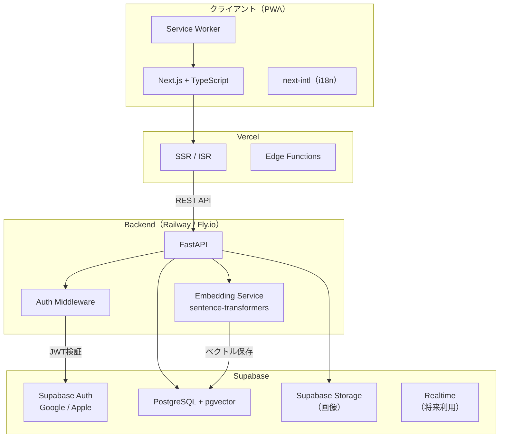
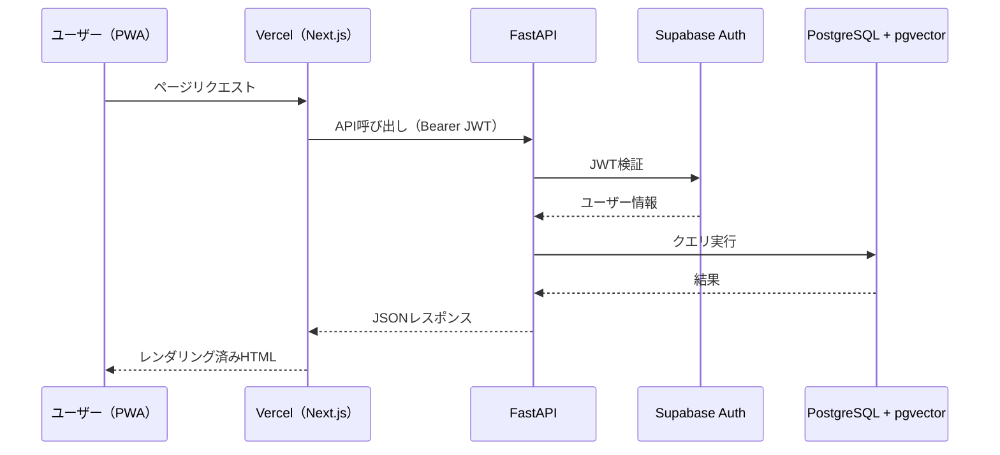
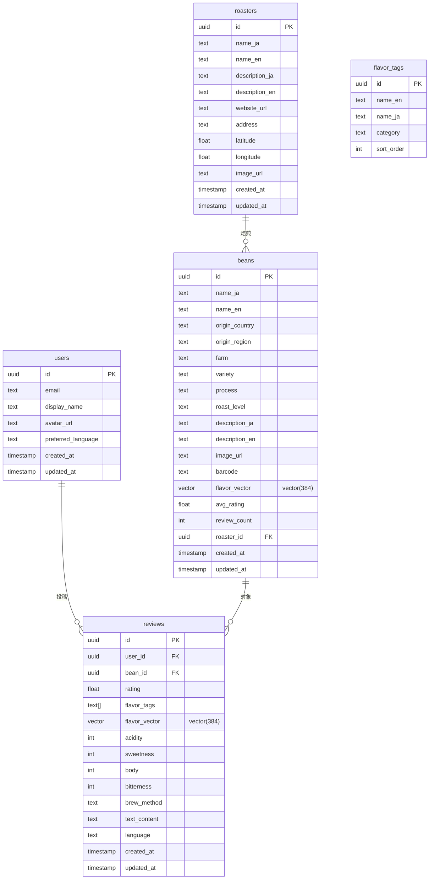
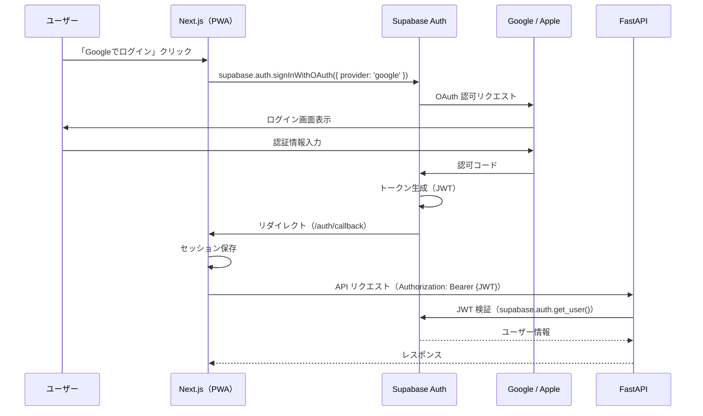
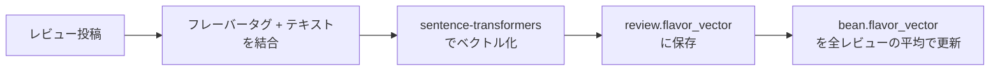

# ☕ BeanLog — 技術設計書

## 1. システムアーキテクチャ

### 1.1 全体構成図



### 1.2 通信フロー概要



---

## 2. Frontend 設計

### 2.1 技術スタック

| 技術 | バージョン | 用途 |
|------|-----------|------|
| Next.js | 15.x (App Router) | フレームワーク |
| TypeScript | 5.x | 型安全 |
| Tailwind CSS | 4.x | スタイリング |
| next-intl | 3.x | 多言語対応（i18n） |
| @supabase/ssr | latest | Supabase Auth SSR統合 |
| next-pwa / serwist | latest | PWA対応 |
| Zustand | 5.x | クライアント状態管理 |
| React Hook Form + Zod | latest | フォーム管理・バリデーション |
| TanStack Query | 5.x | サーバー状態管理・キャッシュ |

### 2.2 ページ構成

```
/ ........................... ホーム（トレンド豆・新着レビュー）
/beans ...................... 豆一覧（検索・フィルター）
/beans/[id] ................. 豆詳細（レビュー一覧・類似豆）
/beans/[id]/review .......... レビュー投稿
/roasters ................... ロースター一覧
/roasters/[id] .............. ロースター詳細
/profile .................... マイページ
/profile/reviews ............ マイレビュー一覧
/search ..................... 高度検索（フレーバー・産地・焙煎度）
/auth/login ................. ログイン
/auth/callback .............. OAuth コールバック
```

### 2.3 コンポーネント設計方針

- **Atomic Design** ベース（atoms / molecules / organisms / templates）
- Server Components をデフォルトで使用、インタラクティブ部分のみ `"use client"`
- `TanStack Query` でサーバーデータを管理、`Zustand` はUI状態のみ
- フレーバーホイールは SVG + インタラクティブコンポーネントで実装

### 2.4 主要コンポーネント

| コンポーネント | 説明 |
|--------------|------|
| `FlavorWheel` | SCA フレーバーホイール（タップで選択） |
| `BeanCard` | 豆カード（画像・名前・焙煎度・評価） |
| `ReviewForm` | レビュー投稿フォーム（フレーバー選択 + テキスト + 評価） |
| `SearchFilters` | 検索フィルター（産地・品種・精製・焙煎度・フレーバー） |
| `SimilarBeans` | 類似豆レコメンドカルーセル |
| `RoasterMap` | ロースター地図表示 |

---

## 3. Backend 設計

### 3.1 技術スタック

| 技術 | バージョン | 用途 |
|------|-----------|------|
| Python | 3.12+ | ランタイム |
| FastAPI | 0.115+ | Web フレームワーク |
| SQLAlchemy | 2.x | ORM |
| Alembic | 1.x | マイグレーション |
| pgvector (Python) | 0.3+ | ベクトル型サポート |
| sentence-transformers | 3.x | テキスト埋め込み |
| Pydantic | 2.x | スキーマ・バリデーション |
| supabase-py | 2.x | Supabase クライアント |
| uvicorn | 0.30+ | ASGI サーバー |
| ruff | latest | Linter / Formatter |

### 3.2 レイヤードアーキテクチャ

```
┌─────────────────────────────────────┐
│  Routers（エンドポイント定義）        │
├─────────────────────────────────────┤
│  Schemas（Pydantic モデル）          │
├─────────────────────────────────────┤
│  Services（ビジネスロジック）          │
├─────────────────────────────────────┤
│  Repositories（DB アクセス）          │
├─────────────────────────────────────┤
│  Models（SQLAlchemy モデル）          │
└─────────────────────────────────────┘
```

### 3.3 API 設計（OpenAPI 準拠）

#### 認証

| Method | Path | 説明 |
|--------|------|------|
| POST | `/api/v1/auth/callback` | Supabase OAuth コールバック処理 |
| GET | `/api/v1/auth/me` | 現在のユーザー情報取得 |
| POST | `/api/v1/auth/refresh` | トークンリフレッシュ |

#### 豆（Beans）

| Method | Path | 説明 |
|--------|------|------|
| GET | `/api/v1/beans` | 豆一覧（ページネーション・フィルター） |
| GET | `/api/v1/beans/{id}` | 豆詳細 |
| GET | `/api/v1/beans/{id}/similar` | 類似豆取得（ベクトル検索） |
| POST | `/api/v1/beans` | 豆登録（管理者） |
| PUT | `/api/v1/beans/{id}` | 豆更新（管理者） |
| GET | `/api/v1/beans/search` | 全文検索 + フィルター |

#### レビュー（Reviews）

| Method | Path | 説明 |
|--------|------|------|
| GET | `/api/v1/beans/{id}/reviews` | 豆のレビュー一覧 |
| POST | `/api/v1/beans/{id}/reviews` | レビュー投稿 |
| PUT | `/api/v1/reviews/{id}` | レビュー編集 |
| DELETE | `/api/v1/reviews/{id}` | レビュー削除 |
| GET | `/api/v1/users/{id}/reviews` | ユーザーのレビュー一覧 |

#### ロースター（Roasters）

| Method | Path | 説明 |
|--------|------|------|
| GET | `/api/v1/roasters` | ロースター一覧 |
| GET | `/api/v1/roasters/{id}` | ロースター詳細 |
| GET | `/api/v1/roasters/{id}/beans` | ロースターの取扱豆一覧 |

#### レコメンド

| Method | Path | 説明 |
|--------|------|------|
| GET | `/api/v1/recommend/similar?bean_id={id}` | 類似豆レコメンド |
| GET | `/api/v1/recommend/personal` | パーソナルレコメンド（レビュー履歴ベース） |
| POST | `/api/v1/recommend/by-flavor` | フレーバー指定でレコメンド |

#### リクエスト/レスポンス例

**POST `/api/v1/beans/{id}/reviews`**

```json
// Request
{
  "rating": 4.5,
  "flavor_tags": ["chocolate", "nutty", "caramel"],
  "acidity": 3,
  "sweetness": 4,
  "body": 4,
  "bitterness": 2,
  "brew_method": "pour_over",
  "text": "チョコレートのような甘さが印象的。中煎りにしてはボディもしっかり。",
  "language": "ja"
}

// Response
{
  "id": "uuid",
  "bean_id": "uuid",
  "user_id": "uuid",
  "rating": 4.5,
  "flavor_tags": ["chocolate", "nutty", "caramel"],
  "flavor_vector": null,
  "acidity": 3,
  "sweetness": 4,
  "body": 4,
  "bitterness": 2,
  "brew_method": "pour_over",
  "text": "チョコレートのような甘さが印象的。...",
  "language": "ja",
  "created_at": "2026-02-12T10:00:00Z",
  "updated_at": "2026-02-12T10:00:00Z"
}
```

---

## 4. データベース設計

### 4.1 ER 図



### 4.2 インデックス設計

```sql
-- ベクトル検索用（ivfflat）
CREATE INDEX idx_beans_flavor_vector ON beans
  USING ivfflat (flavor_vector vector_cosine_ops)
  WITH (lists = 100);

CREATE INDEX idx_reviews_flavor_vector ON reviews
  USING ivfflat (flavor_vector vector_cosine_ops)
  WITH (lists = 100);

-- 全文検索用
CREATE INDEX idx_beans_name_ja ON beans USING gin (to_tsvector('japanese', name_ja));
CREATE INDEX idx_beans_name_en ON beans USING gin (to_tsvector('english', name_en));

-- フィルター用
CREATE INDEX idx_beans_origin ON beans (origin_country, origin_region);
CREATE INDEX idx_beans_roast ON beans (roast_level);
CREATE INDEX idx_beans_roaster ON beans (roaster_id);
CREATE INDEX idx_reviews_bean ON reviews (bean_id);
CREATE INDEX idx_reviews_user ON reviews (user_id);
CREATE INDEX idx_beans_barcode ON beans (barcode) WHERE barcode IS NOT NULL;
```

### 4.3 RLS（Row Level Security）ポリシー

Supabase の RLS を活用し、Backend からのアクセスは `service_role` キーを使用。
ユーザー直接アクセスが必要になった場合のポリシー設計：

| テーブル | SELECT | INSERT | UPDATE | DELETE |
|---------|--------|--------|--------|--------|
| beans | 全ユーザー | admin のみ | admin のみ | admin のみ |
| reviews | 全ユーザー | 認証済み | 自分のみ | 自分のみ |
| roasters | 全ユーザー | admin のみ | admin のみ | admin のみ |
| users | 自分のみ | Auth 連動 | 自分のみ | 不可 |

---

## 5. 認証フロー

### 5.1 Supabase Auth + ソーシャルログイン



### 5.2 JWT 検証（Backend）

```python
# 概念コード
from fastapi import Depends, HTTPException
from supabase import create_client

async def get_current_user(authorization: str = Header(...)):
    token = authorization.replace("Bearer ", "")
    supabase = create_client(SUPABASE_URL, SUPABASE_KEY)
    user = supabase.auth.get_user(token)
    if not user:
        raise HTTPException(status_code=401, detail="Unauthorized")
    return user
```

### 5.3 セッション管理

- **アクセストークン**: 1時間有効（Supabase デフォルト）
- **リフレッシュトークン**: `@supabase/ssr` が自動リフレッシュ
- **Cookie ベース**: Next.js SSR でのセッション維持に `@supabase/ssr` のミドルウェアを使用

---

## 6. フレーバーベクトル検索の技術設計

### 6.1 概要

ユーザーのテイスティングノート（フレーバータグ + テキスト）をベクトル化し、
類似した味わいの豆をレコメンドする。

### 6.2 埋め込みモデル

| 項目 | 値 |
|------|-----|
| モデル | `all-MiniLM-L6-v2`（sentence-transformers） |
| ベクトル次元 | 384 |
| 対応言語 | 多言語（日英対応） |
| 推論場所 | Backend サーバー上（CPU推論で十分） |

> **Phase 1 で多言語特化モデル（`paraphrase-multilingual-MiniLM-L12-v2`）への切り替えを検討**

### 6.3 ベクトル化パイプライン



**入力テキスト生成ルール：**
```
"{flavor_tag1}, {flavor_tag2}, ... {flavor_tagN}. {review_text}"
```

例：
```
"chocolate, nutty, caramel. チョコレートのような甘さが印象的。中煎りにしてはボディもしっかり。"
```

### 6.4 類似検索クエリ

```sql
-- 指定した豆に味が似ている豆を取得
SELECT id, name_ja, name_en, avg_rating,
       1 - (flavor_vector <=> $1) AS similarity
FROM beans
WHERE flavor_vector IS NOT NULL
  AND id != $2
ORDER BY flavor_vector <=> $1
LIMIT 10;
```

### 6.5 パーソナルレコメンド

ユーザーの全レビューの `flavor_vector` を平均化し、
その平均ベクトルに近い未レビュー豆をレコメンド。

```sql
-- ユーザーの好みベクトル（アプリ側で計算してクエリに渡す）
SELECT id, name_ja, name_en, avg_rating,
       1 - (flavor_vector <=> $1) AS similarity
FROM beans
WHERE flavor_vector IS NOT NULL
  AND id NOT IN (SELECT bean_id FROM reviews WHERE user_id = $2)
ORDER BY flavor_vector <=> $1
LIMIT 10;
```

---

## 7. 多言語対応（i18n）

### 7.1 方針

| 項目 | 設計 |
|------|------|
| ライブラリ | `next-intl` |
| 対応言語 | 日本語（`ja`）、英語（`en`） |
| デフォルト | `ja` |
| URL 構造 | `/ja/beans/...`、`/en/beans/...` |
| 翻訳ファイル | `frontend/messages/{locale}.json` |

### 7.2 翻訳対象

| 対象 | 方法 |
|------|------|
| UI テキスト（ボタン・ラベル等） | `next-intl` 翻訳ファイル |
| 豆データ（名前・説明） | DB に `name_ja` / `name_en` カラム |
| レビューテキスト | 投稿言語をそのまま表示（`language` フィールド） |
| フレーバータグ | DB に `name_ja` / `name_en` カラム |
| SEO メタデータ | `next-intl` + `generateMetadata()` |

### 7.3 言語検出・切り替え

1. URL パスのロケールプレフィックスを優先（`/en/...`）
2. 未指定時は `Accept-Language` ヘッダーで判定
3. ユーザー設定（`preferred_language`）で上書き可能
4. 言語切り替え UI をヘッダーに配置

---

## 8. PWA 設計

### 8.1 要件

| 項目 | 設計 |
|------|------|
| Service Worker | `serwist`（next-pwa 後継）で自動生成 |
| キャッシュ戦略 | Stale-While-Revalidate（API）、Cache-First（静的アセット） |
| オフライン対応 | 豆詳細・マイレビューをローカルキャッシュ |
| インストール | A2HS（ホーム画面に追加）プロンプト表示 |
| アイコン | 192x192 / 512x512 の PWA アイコン |
| テーマカラー | コーヒーブラウン系（`#4A2C2A`） |

### 8.2 manifest.json

```json
{
  "name": "BeanLog",
  "short_name": "BeanLog",
  "description": "コーヒー豆のレビュー＆発見プラットフォーム",
  "start_url": "/",
  "display": "standalone",
  "background_color": "#FFF8F0",
  "theme_color": "#4A2C2A",
  "icons": [
    { "src": "/icons/icon-192.png", "sizes": "192x192", "type": "image/png" },
    { "src": "/icons/icon-512.png", "sizes": "512x512", "type": "image/png" }
  ]
}
```

### 8.3 キャッシュ戦略の詳細

| リソース | 戦略 | TTL |
|---------|------|-----|
| HTML ページ | Network-First | - |
| API レスポンス（一覧） | Stale-While-Revalidate | 5分 |
| API レスポンス（詳細） | Stale-While-Revalidate | 10分 |
| 画像（豆・ロースター） | Cache-First | 7日 |
| 静的アセット（JS/CSS） | Cache-First | 30日 |
| フォント | Cache-First | 365日 |

---

## 9. セキュリティ設計

| 項目 | 対策 |
|------|------|
| 認証 | Supabase Auth（JWT）、HTTPSのみ |
| CORS | Vercel ドメインのみ許可 |
| Rate Limiting | FastAPI ミドルウェア（100req/min per user） |
| 入力バリデーション | Pydantic スキーマで厳密検証 |
| SQL インジェクション | SQLAlchemy ORM（パラメータバインド） |
| XSS | React の自動エスケープ + CSP ヘッダー |
| ファイルアップロード | 画像のみ許可、サイズ上限 5MB、Supabase Storage |

---

## 10. 非機能要件

| 項目 | 目標 |
|------|------|
| レスポンスタイム | API: < 200ms（p95）、ページ: < 1.5s（LCP） |
| 可用性 | 99.5%（Vercel + Railway SLA） |
| 同時接続 | MVP: 100人、Phase 1: 1,000人 |
| データバックアップ | Supabase 自動バックアップ（日次） |
| 監視 | Vercel Analytics + Sentry（エラートラッキング） |
